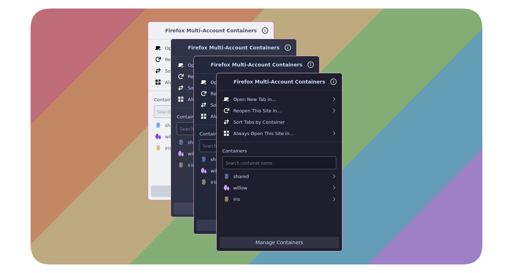

<h3 align="center" style="font-size: 1rem;">
	 
	
	Catppuccin for <a href="https://github.com/mozilla/multi-account-containers#readme">Firefox Multi-Account Containers</a>
	
</h3>

    
    
    

    

## Usage

1. Go to the [Actions -> Builds][builds] section of this repository
2. Click the latest run
3. Scroll down to the "Artifacts" section and download the `Build` artifact.
4. Unzip it and extract the contents to a directory of your choice.
5. In Firefox, go to [Manage Extensions] (about:addons), click the settings icon,
    and select "Install Add-on From File".
6. Then, find and select the `.xpi` file.

aaand waowie!! you're done. Want a matching set? Get [Catppuccin for Firefox]!

## 💝 Thanks to

- [Mozilla](https://github.com/mozilla) for the original extension
- [willow](https://github.com/sillowww)

&nbsp;

Copyright &copy; 2021-present <a href="https://github.com/catppuccin" target="_blank">Catppuccin Org</a>

[builds]: https://github.com/sillowww/ctp-multi-account-containers/actions/workflows/builds.yaml
[Manage Extensions]: about:addons
[Catppuccin for Firefox]: https://github.com/catppuccin/firefox
